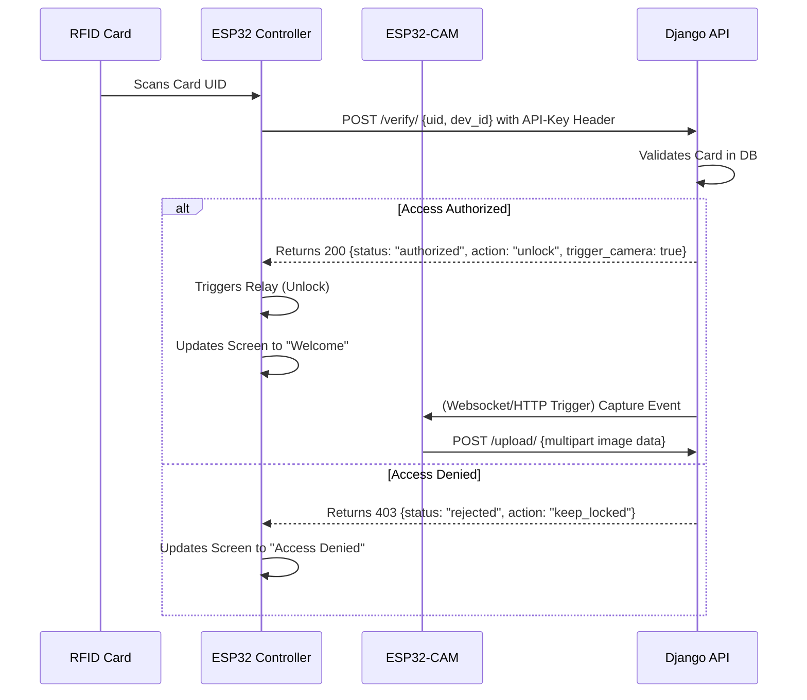

# Security & Authentication Handshake Protocol

This document details how requests are signed, authenticated, and secured.

---

## 1. Authentication Handshake Flow

Below is the step-by-step logic used to verify access requests:

---

## 2. API Security

*   **ESP32 Request Authorization:** Every request from the ESP32 must include a custom request header:
    `X-Device-Token: <SECRET_ESP32_TOKEN>`
*   **Django Validation:** The backend checks the device token against registered IoT devices in Django configuration settings.
*   **Replay Protection (Future):** Introduce UNIX timestamps in requests to prevent replay attacks on the local network.
